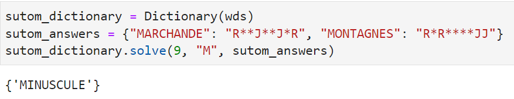

# SUTOM solver & starters 

Si vous lisez ceci, c'est que 1) vous parlez français 2) vous aussi vous êtes fans du jeu [SUTOM](https://sutom.nocle.fr/#). 
Inspiré du jeu MOTUS (Lingo, Wordle en anglais...), les règles sont simples : vous devez trouver un mot avec un certain nombre 
de lettres et commençant par une lettre donnée. A la manière du Mastermind, lorsque vous proposez un mot, les lettres bien 
placées sont indiquées en rouge et celles qui sont dans le mot mystère mais à une autre place sont indiquées en jaune. 
Les autres lettres restent avec un fond bleu.
La petite subtilité vient des lettres répétées. Si vous proposez un mot avec plusieurs lettres identiques, seules les premières
(de gauche à droite) seront indiquées en jaune. Ainsi dans l'exemple suivant, il y a effectivement un L dans le mot mystère (MINUSCULE)
mais seul le premier L de MALLETTES est indiqué en jaune. Nous pouvons donc en déduire qu'il y a un seul L dans le mot mystère et à un
autre endroit.

Néanmoins, lorsqu'une des lettres répétées est placée à la bonne position, la priorité est d'indiquer celle-ci même si l'autre lettre 
est placée plus à gauche. Ainsi dans l'exemple suivant le premier L de MALHABILE n'est pas en jaune même s'il y a un L dans MINUSCULE car
l'autre L placé après est à la bonne position.

De manière générale, les lettres bien placées sont d'abord indiquées puis les autres occurences sont indiquées en jaune tant qu'il y en
a dans le mot mystère. Ce n'est qu'une fois que l'on a dépassé le nombre d'occurences du mot mystère qu'une des lettre n'est pas indiquées
en jaune et que l'on sait exactement combien de lettres il y a dans le mot mystère. Ainsi dans l'exemple suivant, il y a 2 et seulement 2
U dans le mot mystère : un en quatrième position, et un autre qui n'est ni en deuxième ni en sixième position.

En implémentant ces contraintes, l'algorithme du solveur présenté dans le notebook sutom_solver est capable de déterminer à partir des
premières réponses obtenues l'ensemble des 149861 mots du dictionnaire SUTOM (version du 05/03/22) qui correspondent. 

L'objectif présenté dans les autres notebooks est de déterminer les "meilleurs" mots à tester en premier. Pour cela deux méthodes :
* en composant un mot à partir des lettres les plus utilisées dans le dictionnaire SUTOM (notebook sutom_occurence)
* en déterminant le nombre moyen de mots restant une fois la réponse à ce premier mot donnée

La deuxième méthode "brute force" consiste ainsi à calculer pour chaque mot du défi (ex : mot à 9 lettres commençant par L) combien il 
resterait de mots si le mot mystère était un des autres mots du défi. On itère sur chacun des mots mystères possibles pour ajouter le 
nombre de mots restants.
En divisant à la fin par le nombre de mots possibles dans le défi (ex : les 1326 mots à 9 lettres commençant par L), on obtient le nombre
moyen de mots restant.

## Usage

Le solveur peut être rapidement utilisé, en important la classe DIctionary, cf. exemple ci-dessous.

Pour l'utilisation des algorithmes permettant de déterminer les "meilleurs" premiers mots, se référer aux notebooks sutom_occurence et 
sutom_starter.
L'ensemble des résultats compilés (les meilleurs mots pour chaque défi) est compilé (notebook compile_score_files) dans le fichier top_words.

## Built With

The following Python libraries are used in these notebooks:
* [pandas](https://pandas.pydata.org/) - Python Data Analysis Library

## Versions

This code was tested with following versions:
* Python 3.9.4, pandas 1.3.4

## Authors

* **Thomas Dubot** 

## License

This project is licensed under the MIT License - see the [LICENSE.md](LICENSE.md) file for details

## Acknowledgments

Un grand merci aux concepteurs de ce jeu :
* https://sutom.nocle.fr/
* https://framagit.org/JonathanMM/sutom

